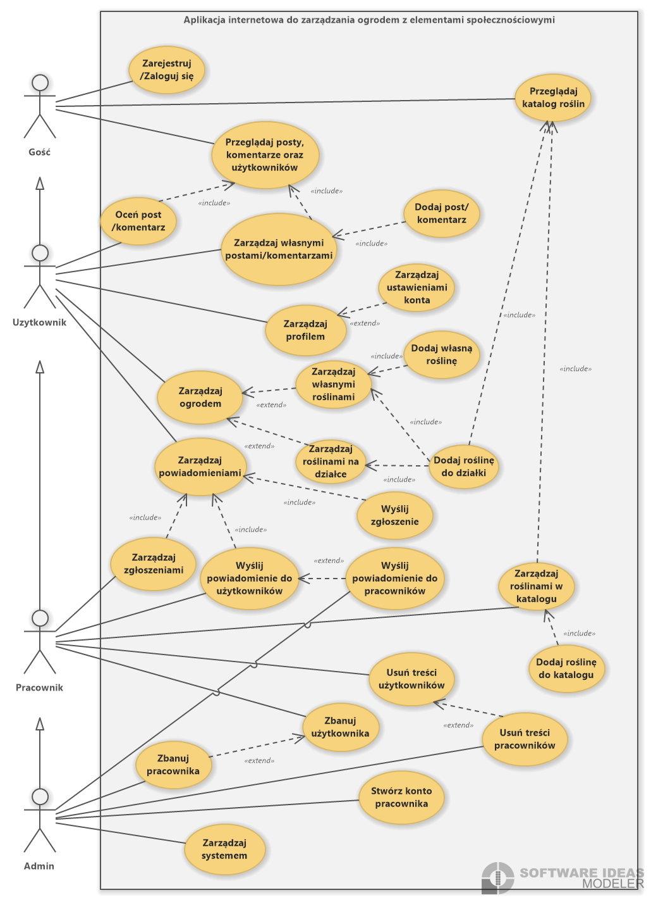

# Wirtualny ogród "Yukka"

Aplikacja internetowa pt. „Wirtualny Ogród Yukka” jest systemem umożliwiającym zarządzanie wirtualnym ogrodem, wymianę wiedzy i doświadczeń pomiędzy użytkownikami w przestrzeni społecznościowej. 

Tworzona aplikacja dostarcza użytkownikom intuicyjne rozwiązania, takie jak system powiadomień o społecznościowych (np. odpowiedź na komentarz, otrzymanie zaproszenia) lub stricte ogrodowych (np. powiadomienie o okresie owocowania roślin) w ogrodzie, możliwość projektowania własnych działek z roślinami wybranymi z katalogu, które można następnie dostosować do swoich upodobań. Możliwe jest również stworzenie własnej rośliny we własnym katalogu. 

Rośliny oficjalne lub własne mogą być posadzone na swojej działce reprezentowanej w formie siatki kafelków, na których znajduje się roślina oraz obszar jej przydzielony pokolorowany wybranym kolorem, albo z nałożoną przez użytkownika teksturą. Sam widok działki wraz z zasadzonymi na jej roślinami może być udostępniony innym użytkownikom. 

## Funkcjonalności

- Rejestracja i logowanie: Użytkownicy mogą zarejestrować się i logować.
- Walidacja email: Konta są aktywowanę za pomocą kodów pozyskanów z wiadomości wysłanej na adres email.
- Przeglądanie katalogu: Użytkownicy mogą przeglądać katalog roślin, dokładnie przeszukując go pod względem cech.
- Zarządzanie roślinami: Pracownicy wykonują operacje CRUDowe na roślinach w katalogu, a także każdy użytkownik może tworzyć własne rośliny.
- Zarządzanie ogrodem: Możliwość zarządzania ogrodem podzielonym na działki, gdzie można sadzić rośliny, przydzielając im określony obszar, pozycję, a także pozwalając na różne modyfikacje.
- Zarządzanie społecznością: Użytkownicy mogą przeglądać posty i komentarze, oceniać je, odpowiadać, a także tworzyć swoje.
- Rozmowy prywatne: Użytkownicy mogą prowadzić między sobą rozmowy prywatne
- Zgłaszanie i banowanie: Użytkownicy mogą zgłaszać innych użytkowników, a pracownicy ich banować

#### Diagram Przypadków Użycia

## Technologie

### Backend

- Spring Boot
- Spring Security
- Spring Data Neo4j
- Uwierzytelnianie tokenem JWT
- Dokumentacja OpenAPI oraz Swagger UI

### Frontend
- Angular
- Generator OpenAPI dla Angulara
- Bootstrap
- Html2canvas

## Uruchamianie
Aby uruchomić projekt, należy postąpić zgodnie z instrucjami w pliku:
